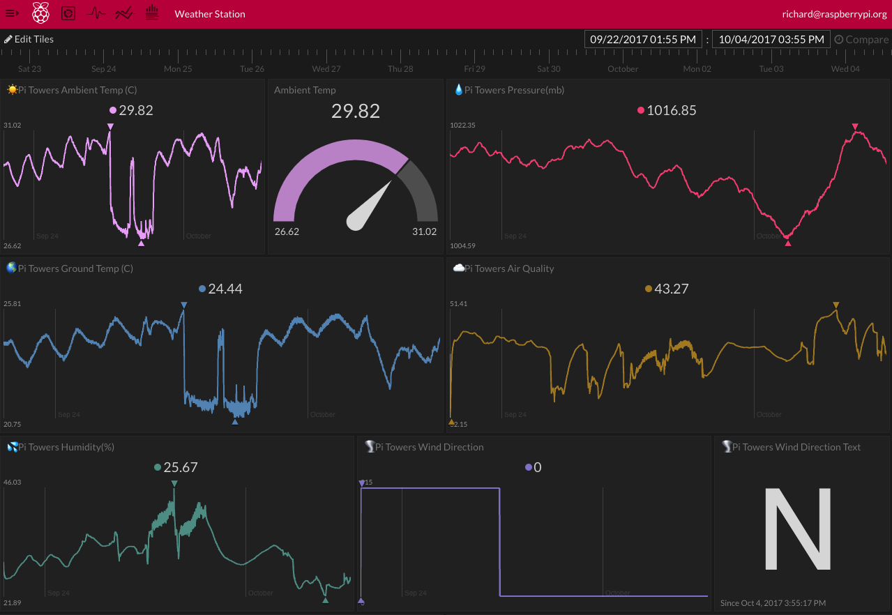

## Introduction

Once you're collecting data with your Oracle Weather Station, it's much easier to work out what's going on through graphs and visualisations. Initial State is an online streaming and visualisation platform to which you can send or upload time series data to your from sensors, devices, software, files, or anything that can make an HTTPS request. Streaming data to your Initial State account allows you to see what is happening in real-time through colourful and customisable dashboards.

### What you will make

You will write Python code to upload data to Initial State and build simple dashboards to display, analyse and share it.

### What you will learn

This project covers elements from the following strands of the [Raspberry Pi Digital Making Curriculum](http://rpf.io/curriculum){:target="_blank"}:

+ [Apply programming constructs to solve a problem](https://curriculum.raspberrypi.org/programming/developer/){:target="_blank"}
+ [Combine inputs and/or outputs to create projects or solve a problem](https://www.raspberrypi.org/curriculum/physical-computing/ddeveloper){:target="_blank"}
