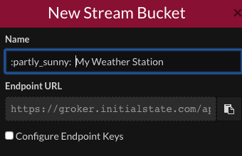
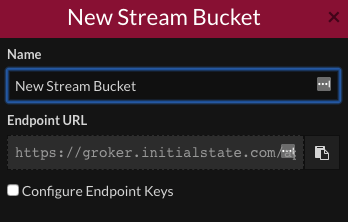

## Registering with Initial State

As a user of one of our Oracle Weather Station kits you will have been pre-issued with a **subscription code** and a **streaming key**. These can be used to access and upload data to a dedicated White Label area hosted by Initial State just for Oracle Weather Station schools.

If you can't find these details, please email weather@raspberrypi.org with your school name and address and the email address of the person who applied for the Weather Station kit.

-Follow [this link](https://rpi.hosted-app.com/#/register/){:target="_blank"} and fill in your email address, choose a password and  then type your **subscription code** into the bottom box.

- Once you're logged in, you can create a **bucket** to store your data.

- Click on the **show/hide the shelf** button in the top left hand cornet of the window.

- Then click on the **Create bucket stream* button.

- Give your new bucket a description name and then check the **configure Endpoint Keys**

- You'll need the **Bucket** and **Access Key** for the next stage.

- You should see that the **Access Key** that you have been issued matches the one shown on this screen.

