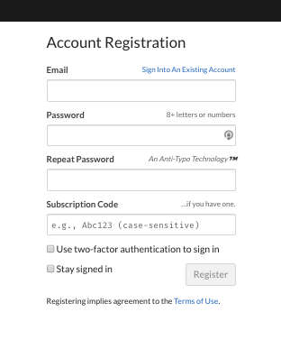
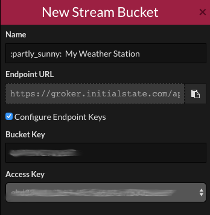

## Registering with Initial State

- First of all, register for an account by following [this link](https://app.initial){:target="_blank"}. Note that you should be over 18 years of age to create an account so if you are younger then this you'll need to get an adult to register on your behalf.

--- collapse ---
---
title: Notes for Raspberry Pi Oracle Weather Station schools
---

If you are using one of our Oracle Weather Station kits you will have been pre-issued with a **subscription code** and a **streaming key**. These can be used to access and upload data to a dedicated White Label area hosted by Initial State just for Oracle Weather Station schools.

If you can't find these details, please email weather@raspberrypi.org with your school name and address and the email address of the person who applied for the Weather Station kit.

Oracle Weather Station users should follow [this link](https://rpi.hosted-app.com/#/register/){:target="_blank"} and in addition to providing an email address and choosing a password, also type your **subscription code** into the bottom box.

--- /collapse ---

- Type in your email address, choose a password and then click on register.

- Now you're logged in, you can create a **bucket** to store your data.

- Click on the **show/hide the shelf** button in the top left hand cornet of the window.

- Then click on the **Create bucket stream* button.

- Give your new bucket a description name and then check the **configure Endpoint Keys**

- You'll need the **Bucket** and **Access Key** for the next stage.

--- collapse ---
---
title: Notes for Raspberry Pi Oracle Weather Station schools
---

If you are using one of our Oracle Weather Station kits you will have been pre-issued with a **subscription code** and a **streaming key**. You should see that the **Access Key** that you have been issued matches the one shown on this screen.

--- /collapse ---
