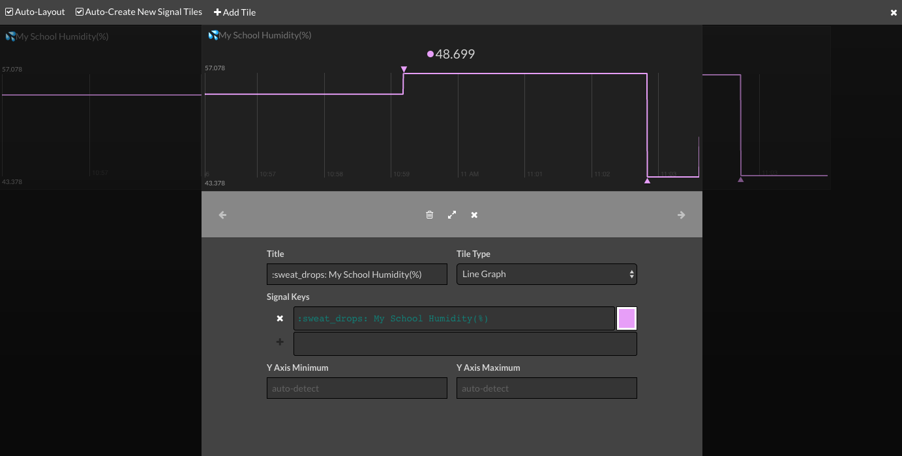

## Uploading data to Initial State

You are going to use the `ISStreamer` Python library to stream data to your Initial State bucket.

- Open a new Python file with Idle (or your favourite Python IDE) and save it into /home/pi as IS-upload.py

-  First of all, import the parts of the ISStreamer library that you need. Add this line at the top.

```python
from ISStreamer.Streamer import Streamer
```

- Now you need to develop the code to process each one of your weather readings. Rather than use actual measurements from your sensors during this development stage, create some test data as Python variables. Add these lines underneath your library imports. If you have a Sense Hat, you should have:

```python
humidity = 55.998
ambient_temp = 23.456
pressure = 1007.890
```

--- collapse ---
---
title: Notes for Raspberry Pi Oracle Weather Station schools
 ---

   You should add the additional test data variables:
```python
ground_temp = 16.345
wind_speed = 5.6129
wind_gust = 12.9030
wind_average = 180
rainfall = 1.270
```
--- /collapse ---

- Then add some more variables to store the Initial State streaming configuration information.

```python

CITY = "Pi Town"
BUCKET_NAME = ":partly_sunny:  My Weather Station"
BUCKET_KEY = credentials['XXXX']
ACCESS_KEY = credentials['YYYY']
SENSOR_LOCATION_NAME = "My School"
```

- Note that you can use [Emojis to decorate and brighten up your dashboard](http://support.initialstate.com/knowledgebase/articles/667693-emojis){:target="_blank"}. Adding `:partly_sunny:` to the bucket name will place a weather symbol next to the text as it is displayed on your Initial State page.


- Now we add the lines of code to stream the data up into our bucket.

- First, create a Streamer with the credentials needed for your data bucket.
```python
streamer = Streamer(bucket_name=BUCKET_NAME, bucket_key=BUCKET_KEY, access_key=ACCESS_KEY)

```

- Start with a single measurement to test the process. For example, your humidity readings.

```python
streamer.log(":sweat_drops: " + SENSOR_LOCATION_NAME + " Humidity(%)", humidity)
```
- Note that the code above uses the `sweat_drops` emoji, but you can change this to another image, or omit it altogether.

- Finally add a line flush the buffer and send the data.

```python
streamer.flush()
```
- Run your code and then take a look at your Initial State account. You should see that a single data point has been plotted.


- One data point isn't very interesting, so change the value of the humidity variable in your code.
```python
humidity = 57.078
```
- Now run your program again.

- Repeat this a few more times and have a loot at the graph that will have been plotted.


- You can experiment with different view options by clicking on the *Edit Tile* button in the top right and then clicking on the graph tile. Choose some of the other Tile Type options and look at the different ways of displaying your data. 




- Now add two more `streamer.log` lines for your temperature and pressure readings.

---hints---
---hint---
You need to include the name of your measurement and a value to be uploaded. You can also pick an emoji to include.
---/hint---
---hint---
This code will upload a temperature reading:
```python

streamer.log(":sunny: " + SENSOR_LOCATION_NAME + " Ambient Temp (C)", ambient_temp)
---/hint---
---hint---
Then add a similar line of code to also upload a pressure reading:
```python

streamer.log(":sunny: " + SENSOR_LOCATION_NAME + " Ambient Temp (C)", ambient_temp)
streamer.log(":droplet: " + SENSOR_LOCATION_NAME + " Pressure(mb)", pressure)
---/hint---
---/hints---
```
--- collapse ---
---
title: Notes for Raspberry Pi Oracle Weather Station schools
---
You'll need to add extra lines for the rest of the Weather Station sensors:
```python
streamer.log(":cloud_tornado: " + SENSOR_LOCATION_NAME + " Wind Direction", wind_average)
streamer.log(":cloud_tornado: " + SENSOR_LOCATION_NAME + " Wind Direction Text", wind_direction_text)
streamer.log(":wind_blowing_face: " + SENSOR_LOCATION_NAME + " Wind Speed", wind_speed)
streamer.log(":wind_blowing_face: " + SENSOR_LOCATION_NAME + " Wind Gust", wind_gust)
streamer.log(":cloud_rain: " + SENSOR_LOCATION_NAME + " Rainfall", rainfall)
streamer.log(":earth_americas: " + SENSOR_LOCATION_NAME + " Ground Temp (C)", ground_temp)
streamer.log(":cloud: " + SENSOR_LOCATION_NAME + " Air Quality", air_quality)
```
--- /collapse ---
