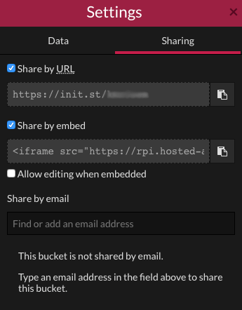

## Challenge: Build and share amazing Weather data dashboards

There are loads of ways to configure your dashboard on Initial State. What interesting correlations between different can you uncover?

- If your Weather Station is mounted onto the side of a building, are there any environmental changes that affect your data? If the air conditioning is activated, does this create a breeze or increase the external temperature?

- Use the different views available to look for regular changes.

- Once you've been streaming data for a while, can you see seasonal changes occurring?

### Sharing dashboards

Initial State makes it easy to share your dashboard on embed it onto a website.

<iframe src="https://rpi.hosted-app.com/embed/?org=rpi#/tiles/22wsoKeXTyk6SEupsOB37GSeiwJyHvVj"></iframe>

- Click on the **settings** link for your dashboard in the right hand pane and then select the **Sharing** tab.

- Can you add a widget for your Weather Station data to your blog or other website?

- We'd love to see your Initial State dashboards when you've finished, so please use the **Share by email** box and send yours to  to weather@raspberrypi.org - we might feature it on our Weather Station page!

### Other Weather Station projects

- How about trying some of our other Weather Station resources on [raspberrypi.org](https://raspberrypi.org) to learn how to access the Oracle Weather Station database and play with data from around the world?
  - [Fetching the weather](https://projects.raspberrypi.org/en/projects/fetching-the-weather)
  - [Graphing the weather](https://projects.raspberrypi.org/en/projects/graphing-the-weather)
  - [Mapping the weather](https://projects.raspberrypi.org/en/projects/mapping-the-weather)
