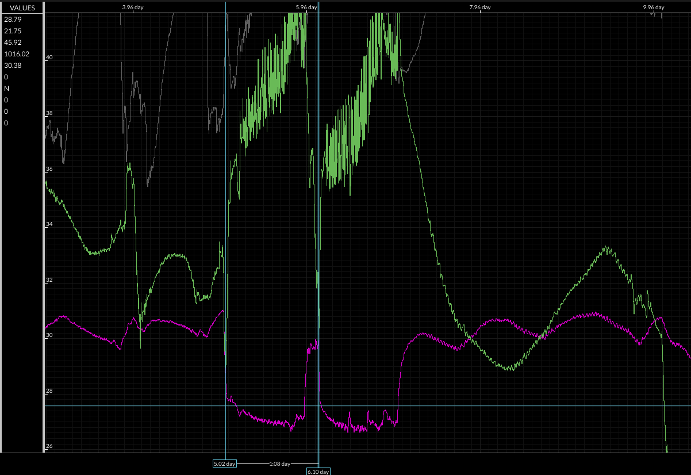
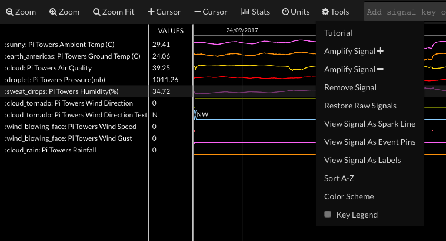

## Visualising your data
There are four main display views in Initial State. Each one can be useful in Visualising and understanding your data in different ways.

You can select the different views using the button in the top left hand corner of the page for each bucket.

### Tiles view

This is the general dashboard view you have already seen. You can display each data stream using a differnet dashboard widget, and even have multiple views of the same data stream (for example you can have a gauge view alongside a line graph for ambient temperature).

### Source view

The **Source view** is a simple list of every data point uploaded to your bucket. This can be useful in debugging any problems with your upload and you can also export this list as a CSV file by clicking on the **Save As File** button.

### Lines view

Lines is an interactive, stacked line graph view. You can examine multiple numerical-based signals on a shared x and y axis. This makes it easy to measure time and magnitude differences and spot correlations between data.

In the example below, you can see overlaid plots of ground temperature, Ambient temperature. humidity and air quality. On the far left of the timeline there is a clear correlation between the two temperature values, as used expect. However you can also see an inverse correlation between humidity and temperature: humidity rises to a maximum when the temperature is at its lowest.

Towards the centre of the plot you can see a change in the pattern with much larger changes in amplitude of these measurements.

You can zoom in on a particular region of the plot and measure the differences in values using the cursors (you can add a cursor from the Tools menu). In the example below you can see from the blue cursor lines that the time separation between the spikes in temperature (and corresponding sharp dips in humidity) is almost exactly 1 day.

Note that you can set the units in which value are presented via the Units menu.

### Waves view

The Waves option is an interactive, multi-row waveform viewer. You can examine your data in more detail by zooming in/out, collecting targeted statistics, and moving signals around.

The type of data loaded determines how it is displayed. Numerical data is drawn as spark lines. Data with only two values that have a true/false connotation (e.g., up/down, open/closed) are drawn as bit signals.  String data is drawn as a digital string bus.

The default layout for the Waves view is for all data streams to be the same height.

You can make any single stream larger by selecting it so that it is highlighted and then clicking on the **Tools** menu item and choosing **Amplify Signal +**

The more times you click, the taller that stream's plot will become. In the example below, the humidity plot has been amplified to reveal more detail.

For data that can be represented as a string, such as the Wind Direction, the **Signal Stats** option, available from the *Stats* menu item is a great way of seeing how much time the data has been a particular value.

In the example below you can see that most common wind direction is from the South or South West (which is what you would expect during the summer in the UK).

